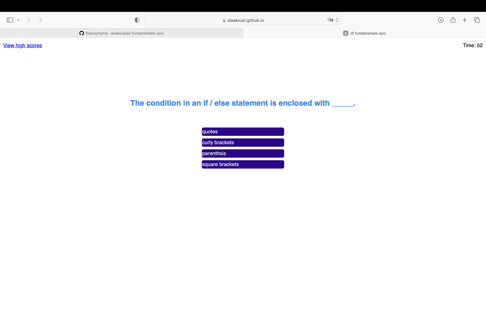

# js-fundamentals-quiz
Enjoy your time with JavaScript fundamentals quiz, choose the correct answers within specific time.

## Quiz rules:
* Choose correct answer from options provided.
* Once you choose an answer, it will automatically navigate you to next question.
* If your answer is correct you will get 20 points.
* If your answer is incorrect you will deduct 10 sec. from your quiz time as a penalty.

## Mock-up
 js-fundamentals-quiz webpage URL:
 https://alaakouki.github.io/js-fundamentals-quiz/

The following image is how js fundamentals quiz webpage shows to
users on desktop screens:
